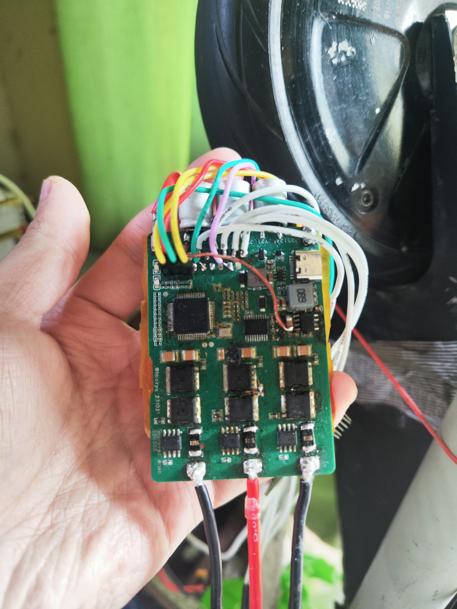
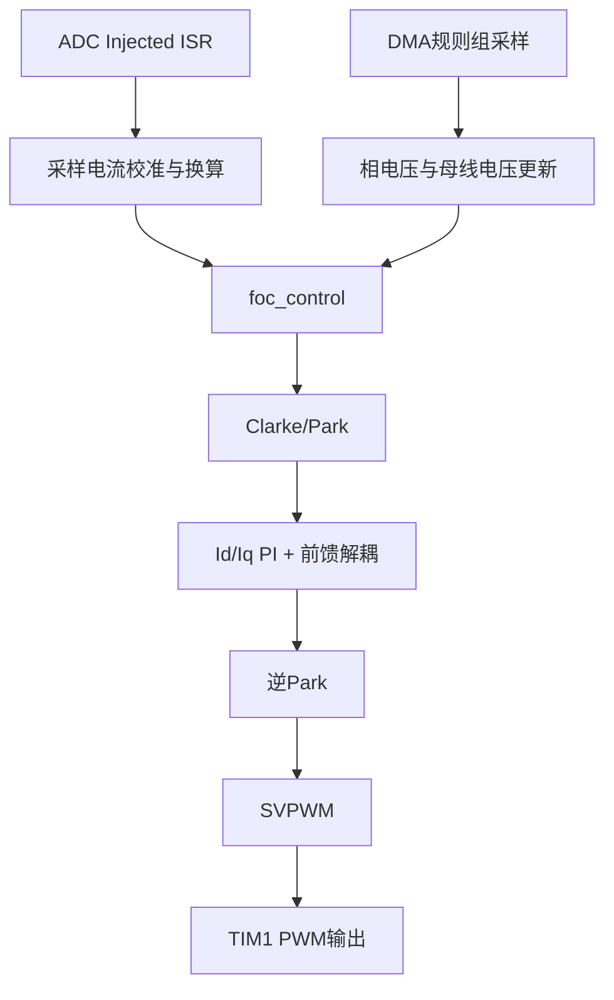

# H_FOC_V1.0

<p align="center">
  
</p>

<p align="center">
  
  
  
  
  
</p>

> 一代 FOC 控制程序，STM32 平台下的无感控制方案验证与工程化落地。

## 目录

- [项目简介](#项目简介)
- [核心特性](#核心特性)
- [系统架构](#系统架构)
- [快速开始](#快速开始)
- [关键配置](#关键配置)
- [任务模型](#任务模型)
- [硬件引脚映射](#硬件引脚映射)
- [目录结构](#目录结构)
- [调试与观测](#调试与观测)
- [当前实现状态](#当前实现状态)
- [贡献指南](#贡献指南)
- [许可证](#许可证)

## 项目简介

`H_FOC_V1.0` 是一个基于 `STM32F405RGTx` 的三相 PMSM/BLDC FOC 控制工程，主要技术路线如下：

- 控制内核：`Clarke/Park + PI + 反Park + SVPWM`
- 调度框架：`FreeRTOS` 多任务
- 采样链路：`TIM1 TRGO` 同步触发 `ADC1` 注入组（电流）与规则组（电压 + DMA）
- 位置/速度估计：`Hall-PLL`、磁链观测器、SMO（滑模观测器）
- 工程定位：可直接在 Keil 中编译烧录，便于二次开发和算法实验

## 核心特性

- 支持三相电流采样与母线/相电压采样
- 支持 FOC 电流闭环主路径（默认）
- 预留速度环、位置环控制接口
- 集成磁链观测器与 SMO 观测器框架
- 集成参数辨识流程（`Rs/Ld/Lq/Flux`，编译期开关）
- 支持 UART 高速调试输出（`USART3 @ 2000000`）
- 提供 Hall 传感器 PLL 角度与速度估计

## 系统架构



控制入口链路：

- `USER/main.c` -> `foc_bsp_init()` -> `foc_app_init()` -> `foc_task_init()` -> `vTaskStartScheduler()`
- 高频控制闭环在 `ADC_IRQHandler()` 中调用 `foc_control()`

## 快速开始

### 1) 环境准备

- Keil MDK5（工程文件：`H_FOC_V1.0.uvprojx`）
- ST-Link 或等效下载器
- 目标硬件：`STM32F405RGTx + 三相逆变桥 + 电流采样 + Hall(可选)`

### 2) 编译与下载

1. 用 Keil 打开 `H_FOC_V1.0.uvprojx`
2. 选择目标 `H_FOC`
3. 编译并下载到板卡
4. 上电后通过串口查看调试输出

### 3) 运行前建议

1. 确认 `APP/Config.h` 中电机参数与硬件采样参数
2. 确认电流采样极性与零偏校准正确
3. 首次调试建议限压限流并空载测试

## 关键配置

主要配置文件：`APP/Config.h`

| 配置项 | 默认值 | 说明 |
| --- | --- | --- |
| `FOC_MODE` | `FOC_MODE_SPEED` | 预留模式开关（当前主控制路径为电流闭环） |
| `PWM_FREQ` | `20000.0f` | PWM/电流环基础频率 |
| `MOTOR_POLE_PAIRS` | `15` | 电机极对数 |
| `MOTOR_RESISTANCE` | `0.145f` | 相电阻 |
| `MOTOR_INDUCTANCE_Ld/Lq` | `0.000355f / 0.000425f` | d/q 轴电感 |
| `MOTOR_FLUX_LINKAGE` | `0.0037f` | 磁链 |
| `VOLTAGE_LIMIT` | `8.0f` | 电压限制 |
| `CURRENT_LIMIT` | `20.0f` | 电流限制 |
| `DEBUG_MODE` | `1` | 调试打印开关 |

观测器/辨识相关编译开关位于：`APP/foc_control.h`

| 开关 | 默认值 | 说明 |
| --- | --- | --- |
| `FLUX_OBSERVER_ENABLE` | `0` | 磁链观测器显式开关 |
| `SMO_OBSERVER_ENABLE` | `1` | SMO 观测器框架开关 |
| `FOC_PARAMETER_IDENTIFICATION_ENABLE` | `0` | 参数辨识流程开关 |
| `HFI_ENABLE` | `0` | HFI 高频注入开关（实验功能） |

## 任务模型

任务创建在 `APP/foc_init.c`，优先级定义在 `APP/foc_init.h`：

| 任务名 | 函数 | 优先级 | 作用 |
| --- | --- | --- | --- |
| `LedProc` | `vLEDProcessTask` | 2 | 指示灯闪烁 |
| `DebugProc` | `vDebugProcessTask` | 1 | 调试任务占位 |
| `GatherProc` | `vGatherProcessTask` | 3 | 规则组 ADC 数据处理 |
| `FOCControl` | `vFOCControlTask` | 4 | 控制参数初始化与调试输出 |

注：实时控制主链路在 ADC 注入组中断中执行，任务主要负责外围与管理逻辑。

## 硬件引脚映射

### PWM（TIM1）

| 功能 | 引脚 |
| --- | --- |
| `TIM1_CH1/CH2/CH3` 高侧 | `PA8/PA9/PA10` |
| `TIM1_CH1N/CH2N/CH3N` 低侧 | `PB13/PB14/PB15` |

### ADC 采样

| 采样量 | 通道 | 引脚 |
| --- | --- | --- |
| `IA` | `ADC1_CH10` | `PC0` |
| `IB` | `ADC1_CH11` | `PC1` |
| `IC` | `ADC1_CH12` | `PC2` |
| `VA` | `ADC1_CH0` | `PA0` |
| `VB` | `ADC1_CH1` | `PA1` |
| `VC` | `ADC1_CH2` | `PA2` |
| `VBUS` | `ADC1_CH13` | `PC3` |

### Hall 与调试串口

| 功能 | 引脚 |
| --- | --- |
| Hall A/B/C | `PC6/PC7/PC8` |
| `USART3_TX/RX` | `PB10/PB11` |

## 目录结构

```text
H_FOC_V1.0
├─ APP/                  # 控制算法与任务层
│  ├─ Config.h           # 核心参数配置
│  ├─ foc_control.*      # FOC主控制逻辑
│  ├─ foc_conversion.*   # 坐标变换、SVPWM、PI计算
│  ├─ foc_sensorless.*   # 磁链/SMO/HFI观测器
│  ├─ foc_parameter_ident.* # 电机参数辨识
│  ├─ foc_encoder.*      # Hall-PLL
│  └─ foc_init.*         # BSP/APP/Task初始化
├─ BSP/                  # 板级驱动（PWM/ADC/UART/GPIO）
├─ USER/                 # 启动与主函数
├─ FreeRTOS/             # RTOS内核
├─ FWLIB/                # STM32 StdPeriph
├─ Drivers/              # CMSIS/HAL等第三方组件
└─ H_FOC_V1.0.uvprojx    # Keil工程文件
```

## 调试与观测

- `debug_log(...)`：阻塞串口输出（换行）
- `debug_printf(...)`：DMA 发送，适合高频数据打印
- 默认串口：`USART3`, `2000000 bps`, `8N1`

建议在调试阶段输出以下量：

- `Id/Iq` 目标与反馈
- 电角度（Hall / Flux / SMO）
- `SVPWM` 占空比与母线电压

## 当前实现状态

- 已完成：三相采样 + FOC 电流闭环主链路
- 已完成：Hall-PLL、磁链观测、SMO 框架
- 可选启用：参数辨识流程（编译期开关）
- 预留接口：速度环与位置环闭环联动
- 实验功能：HFI 注入与混合模式（默认关闭）

## 贡献指南

欢迎提交 `Issue`/`PR`，建议遵循以下约定：

1. 先描述硬件环境（电机参数、母线电压、采样电阻、驱动板）
2. 提交前附上关键波形或日志（电流、电角度、占空比）
3. 新增算法请尽量提供可复现实验参数

## 许可证

当前仓库为 `MIT License`
